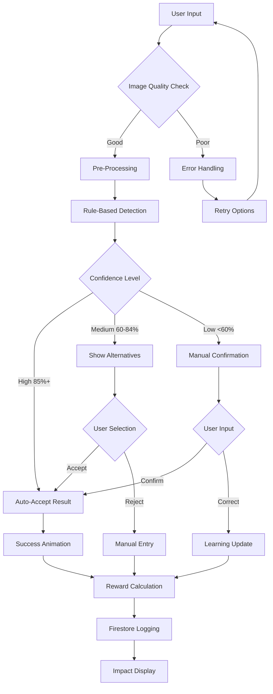

# AI-Powered Waste Detection Implementation Guide

## 🎯 System Overview

This transparent AI detection system prioritizes user trust through clear explanations, confidence scoring, and graceful handling of uncertainty. The system uses rule-based logic that's predictable and explainable rather than black-box ML models.

## 🔄 Complete Detection Flow



## 📊 Firestore Schema Implementation

### Detection Records Collection
```typescript
// Collection: /detections/{detectionId}
{
  // Core Identifiers
  id: "det_1234567890",
  userId: "user_abc123",
  sessionId: "session_20241205_143022",
  
  // Input Data
  input: {
    imageUrl: "gs://bucket/detections/session_123/image.jpg",
    imageMetadata: {
      size: 2048576,
      type: "image/jpeg",
      dimensions: { width: 1920, height: 1080 }
    },
    weight: 150,
    size: "small",
    userHints: ["iPhone", "old", "cracked screen"]
  },
  
  // AI Detection Results
  detection: {
    primaryResult: {
      itemType: "smartphone",
      itemName: "iPhone 11 Pro",
      confidence: 87,
      explanation: "Strong match detected! The weight (150g) and size perfectly match..."
    },
    alternativeResults: [
      {
        itemType: "tablet",
        itemName: "iPad Mini",
        confidence: 23,
        explanation: "Could be a small tablet based on weight..."
      }
    ],
    processingTime: 2340,
    algorithm: "rule-based-v1"
  },
  
  // User Interaction
  userFeedback: {
    accepted: true,
    correctedItem: null,
    confidenceRating: 4,
    additionalNotes: "Actually it's an iPhone 12, but close enough"
  },
  
  // Calculated Impact
  calculated: {
    pointsEarned: 100,
    carbonSaved: 0.8,
    recyclingValue: 25,
    materials: ["lithium", "gold", "silver", "copper", "plastic"]
  },
  
  // System Metadata
  metadata: {
    createdAt: "2024-12-05T14:30:22Z",
    updatedAt: "2024-12-05T14:31:15Z",
    location: {
      lat: 37.7749,
      lng: -122.4194,
      binId: "bin_sf_downtown_01"
    },
    deviceInfo: {
      userAgent: "Mozilla/5.0...",
      platform: "iPhone",
      appVersion: "1.2.0"
    },
    flags: {
      lowConfidence: false,
      manualOverride: false,
      suspicious: false
    }
  }
}
```

### Analytics Collection
```typescript
// Collection: /detection_analytics/{date}
{
  date: "2024-12-05",
  totalDetections: 1247,
  averageConfidence: 78.3,
  accuracyRate: 0.89, // Based on user feedback
  
  topItems: [
    { itemType: "smartphone", count: 456, avgConfidence: 82.1 },
    { itemType: "cable", count: 234, avgConfidence: 71.5 },
    { itemType: "laptop", count: 189, avgConfidence: 85.7 }
  ],
  
  confidenceDistribution: {
    high: 0.45,    // 85%+ confidence
    medium: 0.38,  // 60-84% confidence
    low: 0.17      // <60% confidence
  },
  
  userCorrectionRate: 0.11,
  lowConfidenceRate: 0.17,
  
  performanceMetrics: {
    avgProcessingTime: 2100,
    errorRate: 0.03,
    retryRate: 0.08
  }
}
```

## 🧠 Detection Algorithm Logic

### Weight Scoring Function
```typescript
function calculateWeightScore(weight: number, rule: WeightRule): number {
  const { min, max, optimal } = rule
  
  // Outside range = 0 score
  if (weight < min || weight > max) return 0
  
  // Calculate distance from optimal
  const distance = Math.abs(weight - optimal)
  const range = max - min
  const normalizedDistance = distance / range
  
  // Closer to optimal = higher score
  return Math.max(0, 1 - normalizedDistance)
}
```

### Confidence Calculation
```typescript
function calculateConfidence(scores: DetectionScores): number {
  const weightedScore = 
    scores.weight * 0.4 +      // Weight is most important
    scores.size * 0.3 +        // Size is second most important
    scores.keywords * 0.2 +    // User hints help
    scores.boost * 0.1         // Item-specific boost
  
  return Math.min(Math.round(weightedScore * 100), 100)
}
```

### Rule Matching Engine
```typescript
function findBestMatch(input: DetectionInput): DetectionResult {
  let bestMatch = null
  let bestScore = 0
  
  for (const [itemType, rule] of Object.entries(DETECTION_RULES)) {
    const scores = {
      weight: calculateWeightScore(input.weight, rule.weight),
      size: rule.size.includes(input.size) ? 1 : 0,
      keywords: calculateKeywordScore(input.userHints, rule.keywords),
      boost: rule.confidence_boost
    }
    
    const totalScore = calculateConfidence(scores)
    
    if (totalScore > bestScore) {
      bestScore = totalScore
      bestMatch = { itemType, rule, confidence: totalScore }
    }
  }
  
  return bestMatch || createUnknownResult(input)
}
```

## 🎨 UX State Management

### Confidence-Based UI States
```typescript
function getUIState(confidence: number): UIState {
  if (confidence >= 85) {
    return {
      type: 'high_confidence',
      color: 'green',
      icon: 'verified',
      message: SUCCESS_MESSAGES.highConfidence,
      actions: ['confirm', 'retry']
    }
  }
  
  if (confidence >= 60) {
    return {
      type: 'medium_confidence',
      color: 'yellow',
      icon: 'help',
      message: SUCCESS_MESSAGES.mediumConfidence,
      actions: ['confirm', 'alternatives', 'retry']
    }
  }
  
  return {
    type: 'low_confidence',
    color: 'red',
    icon: 'warning',
    message: LOW_CONFIDENCE_STATES.needsHelp,
    actions: ['manual_entry', 'retry', 'skip']
  }
}
```

### Error Handling Strategy
```typescript
function handleDetectionError(error: DetectionError): ErrorResponse {
  const errorMap = {
    'IMAGE_TOO_LARGE': ERROR_MESSAGES.imageTooLarge,
    'PROCESSING_TIMEOUT': ERROR_MESSAGES.processingTimeout,
    'NETWORK_ERROR': ERROR_MESSAGES.networkError,
    'UNSUPPORTED_FORMAT': ERROR_MESSAGES.unsupportedFormat
  }
  
  return errorMap[error.code] || ERROR_MESSAGES.detectionFailed
}
```

## 🎬 Animation Sequences

### Scanning Animation Timeline
```typescript
const SCANNING_SEQUENCE = [
  { phase: 'initializing', duration: 500, animation: 'fadeIn' },
  { phase: 'analyzing', duration: 1000, animation: 'pulse' },
  { phase: 'matching', duration: 800, animation: 'rotate' },
  { phase: 'calculating', duration: 700, animation: 'progress' }
]

async function playDetectionAnimation(): Promise<void> {
  for (const phase of SCANNING_SEQUENCE) {
    updateUI(phase)
    await delay(phase.duration)
  }
}
```

### Result Reveal Animation
```typescript
const RESULT_SEQUENCE = [
  { element: 'confidence', animation: 'countUp', duration: 800 },
  { element: 'itemName', animation: 'typewriter', duration: 1200 },
  { element: 'explanation', animation: 'slideUp', duration: 600 },
  { element: 'impact', animation: 'bounceIn', duration: 400 }
]
```

### Reward Celebration
```typescript
const REWARD_SEQUENCE = [
  { effect: 'confetti', duration: 2000 },
  { effect: 'pointsCounter', duration: 1500 },
  { effect: 'impactStats', duration: 1000 },
  { effect: 'levelUp', duration: 800, conditional: true }
]
```

## 📱 Component Integration

### Scanner Page Integration
```typescript
// app/(dashboard)/scanner/page.tsx
import { DetectionFlow } from '@/components/scanner/detection-flow'

export default function ScannerPage() {
  const handleDetectionComplete = (result: DetectionResult) => {
    // Navigate to success page with result
    router.push(`/scanner/success?id=${result.id}`)
  }

  return (
    <div className="min-h-screen bg-background-light dark:bg-background-dark">
      <DetectionFlow 
        onComplete={handleDetectionComplete}
        onCancel={() => router.back()}
      />
    </div>
  )
}
```

### Success Page Integration
```typescript
// app/(dashboard)/scanner/success/page.tsx
export default function SuccessPage({ searchParams }: { searchParams: { id: string } }) {
  const [result, setResult] = useState<DetectionResult | null>(null)
  
  useEffect(() => {
    if (searchParams.id) {
      loadDetectionResult(searchParams.id).then(setResult)
    }
  }, [searchParams.id])

  return result ? <SuccessScreen result={result} /> : <LoadingSpinner />
}
```

## 🔄 Continuous Learning System

### Feedback Collection
```typescript
async function collectUserFeedback(
  detectionId: string,
  feedback: UserFeedback
): Promise<void> {
  // Update detection record
  await updateDoc(doc(db, 'detections', detectionId), {
    userFeedback: feedback,
    'metadata.updatedAt': Timestamp.now()
  })
  
  // Update learning metrics
  await updateLearningMetrics(feedback)
}
```

### Accuracy Tracking
```typescript
async function updateAccuracyMetrics(feedback: UserFeedback): Promise<void> {
  const today = new Date().toISOString().split('T')[0]
  const analyticsRef = doc(db, 'detection_analytics', today)
  
  await updateDoc(analyticsRef, {
    totalFeedback: increment(1),
    correctPredictions: increment(feedback.accepted ? 1 : 0),
    userCorrections: increment(feedback.correctedItem ? 1 : 0)
  })
}
```

## 🚀 Performance Optimizations

### Image Processing
- Resize images to max 1920x1080 before upload
- Compress to 80% quality for faster processing
- Generate thumbnails for UI display
- Use WebP format when supported

### Caching Strategy
- Cache detection rules in memory
- Store recent results in localStorage
- Implement service worker for offline detection
- Use CDN for static assets

### Database Optimization
- Index on userId, createdAt for user queries
- Index on itemType, confidence for analytics
- Batch write operations where possible
- Use Firestore offline persistence

## 🔒 Privacy & Security

### Data Protection
- Hash user identifiers before storage
- Encrypt sensitive metadata
- Auto-delete images after 30 days
- Anonymize analytics data

### User Control
- Allow users to delete their detection history
- Provide data export functionality
- Clear consent for data usage
- Opt-out options for analytics

This implementation provides a transparent, trustworthy AI detection experience that prioritizes user understanding and engagement over pure accuracy metrics.